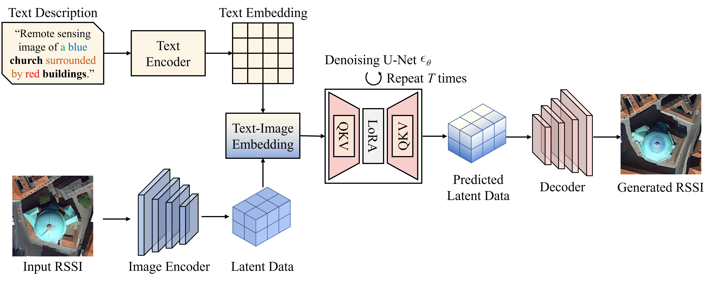
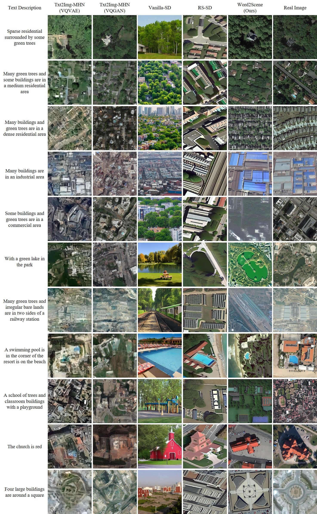
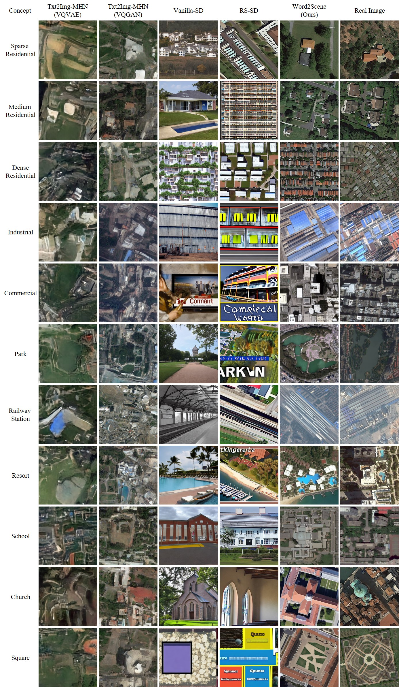
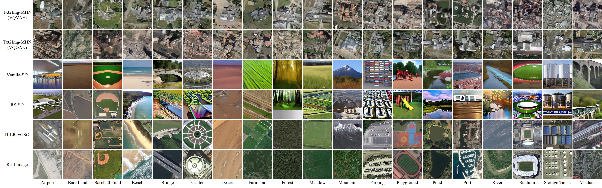
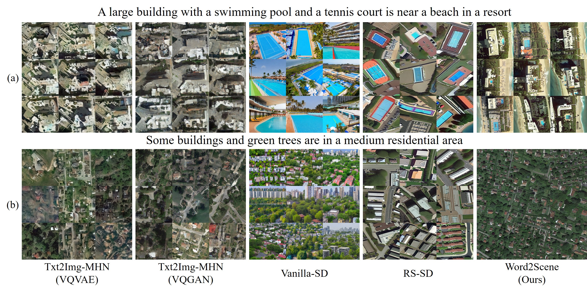
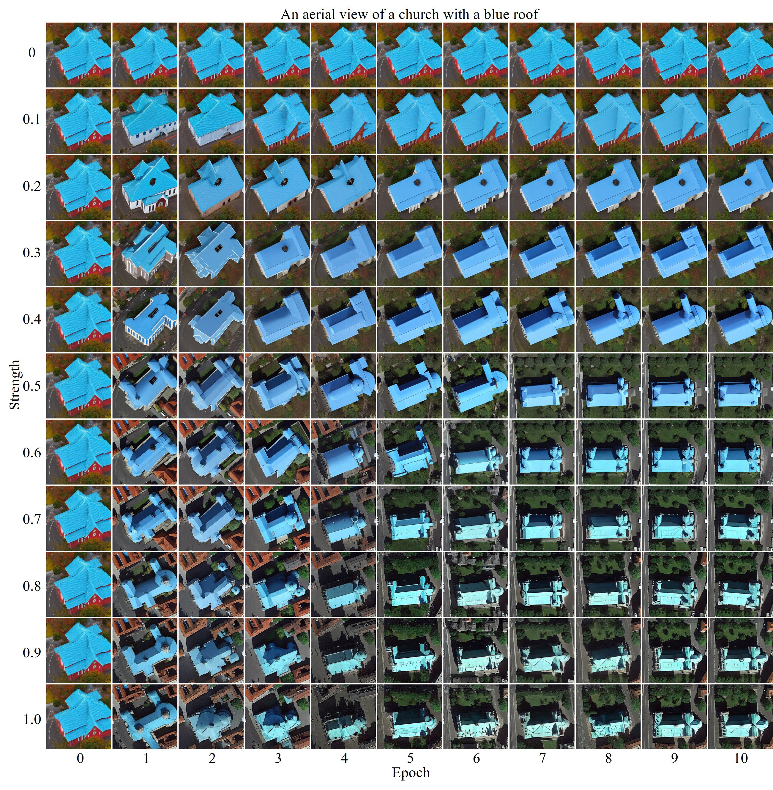
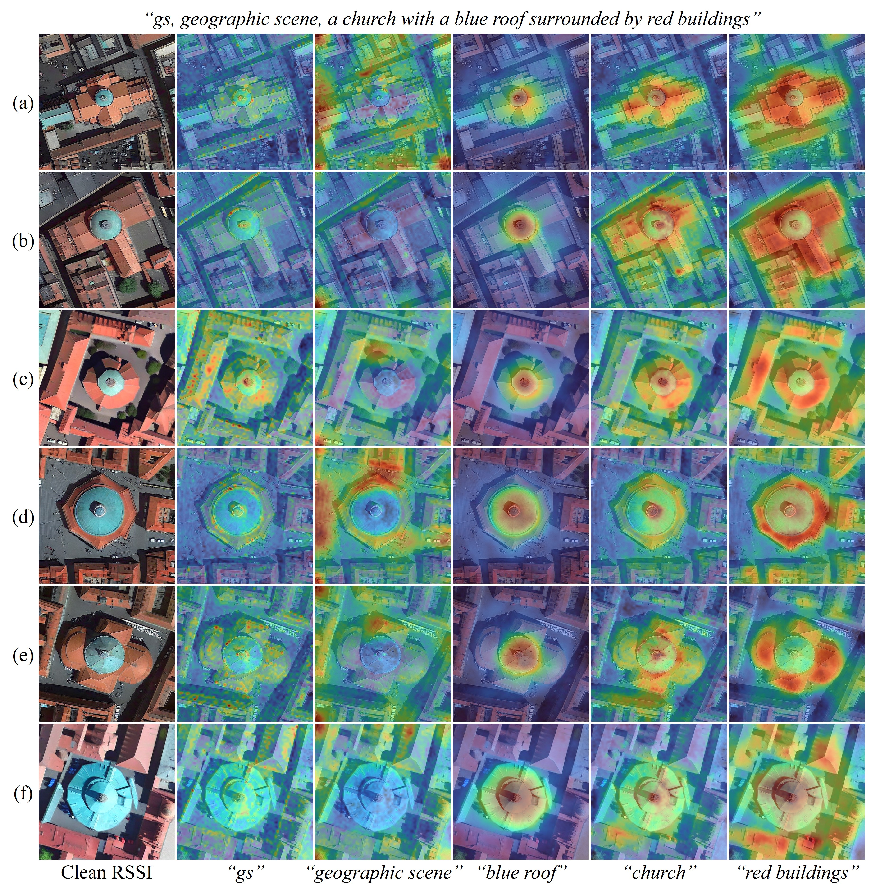

<h1 align="center">Word2Scene: Efficient remote sensing scene generation with only one word via hybrid intelligence and low-rank representation</h1>



    
This is the official PyTorch implementation of the paper **[Word2Scene: Efficient remote sensing scene generation with only one word via hybrid intelligence and low-rank representation](https://arxiv.org)**.

GUI

 https://github.com/jaycecd/Word2Sence/assets/33342388/b6e17e54-311c-4f65-b7bd-f8cfee248e68


Preview of the generation process
  
  https://github.com/jaycecd/Word2Sence/assets/33342388/3df4c9ad-17cd-4db9-830e-7f476a8be30b

Note: The codes and pre-trained models will be released upon acceptance of the paper.

### Table of content
1. [Preparation](#preparation)
2. [Training Word2Scene](#Word2Scene)
3. [Image Generation](#gen)
4. [Interpretability of Word2Scene](#interpretability)
5. [Paper](#paper)
6. [Acknowledgement](#acknowledgement)
7. [License](#license)

### 1.Preparation
- Install required packages: `pip install -r requirements.txt`
  

### 2.Training Word2Scene <a name="Word2Scene"></a>
- Train Word2Scene:
```
$ cd Word2Scene-main
$ python train.py --data_dir /Path/To/DATASET/
```

### 3.RS Scene Image Generation <a name="gen"></a>
- **Word2Scene:** Visualization of remote sensing scenes generated from text descriptions in the test set using different text-to-image generation methods. Zoom-in for better details.


- **Word2Scene-C:** Directly generate scenes using scene concepts from the training set. The real image is randomly selected from the images in the corresponding scene concept. Zoom-in for better details.


- **Word2Scene Zero-shot:** Directly generate scenes using scene concepts outside the training set (zero-shot). Zoom-in for better details.


- **Diversity and stability:** These samples were all randomly generated 9 times using the same description on different methods. 


- Comparison of the models obtained at different epochs with the results generated at different lora strengths. 



You can download our pretrained models for a quick look.
  - Word2Scene: [Google Drive](https://drive.google.com) or [Baidu NetDisk](https://pan.baidu.com)

### 4.Interpretability of Word2Scene <a name="interpretability"></a>
- **How does textual input specifically influence the outcome of scene generation?**

    Using heatmaps to explain how text influences scene generation.



### 5.Paper <a name="paper"></a>
**[Word2Scene: Efficient remote sensing scene generation with only one word via hybrid intelligence and low-rank representation](https://arxiv.org)**

Please cite the following paper if you find it useful for your research:


### 6.Acknowledgement <a name="acknowledgement"></a>


### 7.License <a name="license"></a>
This repo is distributed under [MIT License](https://github.com/jaycecd/Word2Sence/blob/main/LICENSE). The code can be used for academic purposes only.
